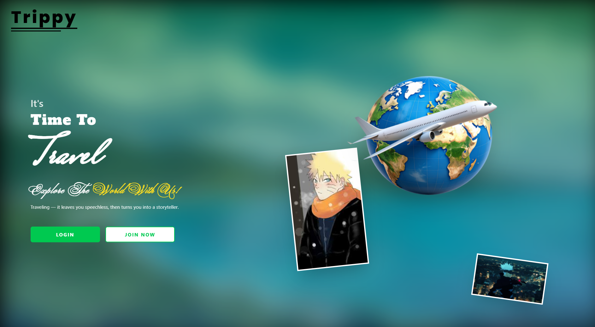

<p align="center">
  
</p>


# Tourist and Travellism Frontend - Version 2

This is the second version of the Tourist and Travellism project, a React-based frontend application designed for travel enthusiasts to plan trips, manage photos, and explore destinations.

## Project Features

- **User Authentication**: Login and registration components for secure access.
- **Trip Planning**: Plan and manage trips with detailed trip pages.
- **Photo Management**: Upload and view photos related to trips.
- **Dashboard**: Overview of user trips and activities.
- **Responsive Design**: Built with React and Vite for fast, modern web experience.
- **API Integration**: Connects to backend APIs for authentication, trips, and photos.

## How to Clone

To clone this repository, run the following command:

```bash
git clone https://github.com/PAMARTHILVSIVANAGESWARARAO/TouristAndTravellismFrontend.git
```

Replace `https://github.com/PAMARTHILVSIVANAGESWARARAO/TouristAndTravellismFrontend.git` with the actual URL of the repository.

## How to Run

1. Navigate to the project directory:
   ```bash
   cd TouristAndTravellismFrontend
   ```

2. Install dependencies:
   ```bash
   npm install
   ```

3. Start the development server:
   ```bash
   npm run dev
   ```

The application will be available at `http://localhost:5173` (default Vite port).

## Directory Structure

```
C:.
│   .gitignore
│   eslint.config.js
│   index.html
│   package-lock.json
│   package.json
│   README.md
│   TODO.md
│   vite.config.js
│
├───public
│       vite.svg
│
└───src
    │   App.css
    │   App.jsx
    │   index.css
    │   main.jsx
    │
    ├───api
    │       authAPI.js
    │       axiosInstance.js
    │       photosAPI.js
    │       tripAPI.js
    │
    ├───assets
    │       Aeroplane.png
    │       Background.jpg
    │       DashboardBackground.jpg
    │       Eren-Yeager.png
    │       male.jpg
    │       male2.jpg
    │       Mikasa-Ackerman.png
    │       react.svg
    │
    ├───Components
    │       Login.jsx
    │       Register.jsx
    │
    ├───Hero
    │       About.css
    │       About.jsx
    │       Footer.css
    │       Footer.jsx
    │       Home.css
    │       Home.jsx
    │
    ├───pages
    │       Dashboard.jsx
    │       Photos.jsx
    │       PlanTrip.jsx
    │       TripDetails.jsx
    │       TripList.css
    │       TripsList.jsx
    │
    └───utils
            auth.js
            protectedRoute.jsx
